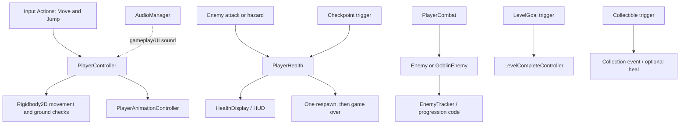

# Architecture

## Runtime overview

The project uses Unity scenes and MonoBehaviours as its composition model. Scenes hold level/menu GameObjects and serialized component references; prefabs package reusable objects; ScriptableObjects hold customization category/option data. Most tunable behavior is exposed through serialized Inspector fields.

The current Unity editor version is **6000.5.1f1**. Rendering uses URP with 2D renderer assets. Input is handled by the New Input System. UI uses Unity UI and TextMesh Pro. The project does not currently declare Cinemachine in its package manifest.

## Source layout

| Directory | Responsibility |
|---|---|
| `Assets/Scripts/Player/` | Movement, health, combat, animation state |
| `Assets/Scripts/Enemies/` | Basic enemy, goblin and wraith behavior, projectiles |
| `Assets/Scripts/Levels/` | Checkpoints, hazards, goals, enemy tracking, progression |
| `Assets/Scripts/UI/` | Menus, HUD, health and completion/game-over UI |
| `Assets/Scripts/Customization/` | Character category/option selection and rendering |
| `Assets/Scripts/SaveSystem/` | Customization data serialization helpers |
| `Assets/Scripts/Audio/` | Shared audio playback/event reactions |
| `Assets/Scripts/Camera/` | Camera follow behavior |
| `Assets/Scripts/Collectibles/` | Trigger-based pickup behavior |

`Assets/Spriter2UnityDX/` contains third-party Spriter importer/editor/runtime support and is separate from the game's core scripts. TextMesh Pro package resources and examples are also included under `Assets/TextMesh Pro/`.

## Scene composition

Six scenes are enabled in Build Settings: the three gameplay levels, MainMenu, LevelSelect, and Customization. Each gameplay scene contains player and gameplay UI objects; all three contain a `LevelGoal` and `Checkpoint`, while Levels 2 and 3 contain an `Enemy_01`. Menu scenes contain UI canvases, buttons, and EventSystem objects. SampleScene and the URP 2D template are present but not in the enabled build list.

The build settings' scene ordering is not itself a guarantee of the desired startup scene. The menu controllers perform scene transitions. Validate serialized references and scene transitions in Unity when changing scene organization.

## Important interactions

The diagram shows code-level relationships rather than asserting that each optional system is placed or activated in every scene.

## Data and event flow

- The player controller reads Input System actions and applies Rigidbody2D movement.
- Health publishes health/death events used by animation and UI systems. Damage sources call the health API.
- Checkpoints update the player's in-memory respawn position. This checkpoint state is not documented as persisted between launches.
- Collectibles publish a static collection event; the current code directly heals the player for health pickups.
- Customization categories/options are ScriptableObjects. The customization manager renders selections and stores option IDs in PlayerPrefs through `CustomizationData`.
- Audio helpers are called by gameplay and UI scripts and depend on clip/AudioSource references assigned in scenes.

## Reusable assets

Current prefabs include `Assets/Prefabs/Player/Player.prefab` and three environment platform prefabs. Customization ScriptableObjects include category definitions and defaults for body, eyes, hair, pants, shirt, and shoes, plus category assets for hat and accessory. Art includes character/enemy part sprites and a heart HUD sprite; audio contains level music and effect clips.

## Packages

The authoritative dependency list is `Packages/manifest.json`. Major systems include Input System 1.19.0, URP 17.5.0, 2D animation 15.1.0, UI 2.5.0, and tilemap/sprite tooling. Cinemachine is absent. A standalone camera-follow script is present under `Assets/Scripts/Camera/`.
